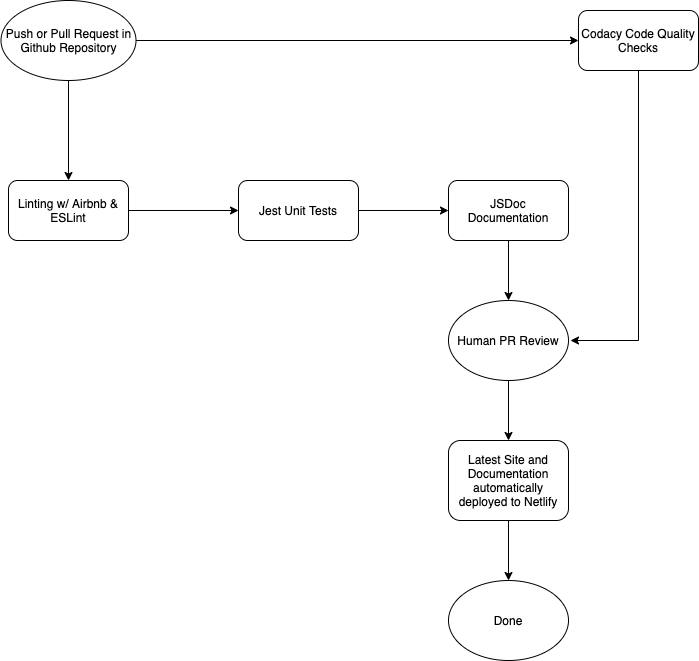

# CI/CD Pipeline Phase 2

The phase 2 updates to our pipeline include running the tests and documentation generation scripts that we have on actual code instead of on sample code.

## Linting

Mostly unchanged from Phase 1, but now we are linting actual code instead of just test code from before because we previously did not have any JavaScript to lint at the time Phase 1 was due.

## Unit Testing

Also mostly unchanged from Phase 1, but we are working on writing some actual unit tests as well. This is still a work in progress.

## Documentation Generation

We have started integrating JSDoc style documentation into our codebase. The documentation is also automatically generated on every single pull request as part of our GitHub Actions pipeline. The documentation is generated on a per-commit basis when the commit is pushed and then the resulting HTML documentation is automatically deployed on Netlify at https://cse110-sp21-group31-docs.netlify.app/. This website reflects documentation consistent with what is in our `main` branch.

We chose Netlify because it was easy to use and set up so that it would update automatically, plus I (Bryce) had previous expertise with Netlify. Finally, our other option, GitHub Pages, is a paid option for private repositories.

## Code Quality

We were able to obtain a license for Codacy's student plan for our usage, so we now have Codacy running code quality tests on our repository on every single pull request.

## Human PR Review

We are continuing to conduct manual human review on every single PR.

## Automatic Deployment

Whenever the `main` branch is modified (e.g. a pull request is merged), Netlify automatically deploys the latest version of our site to https://cse110-sp21-group31.netlify.app/daily_log. This is new and was not a part of phase 1.

## Diagram of the Phase 2 Pipeline

