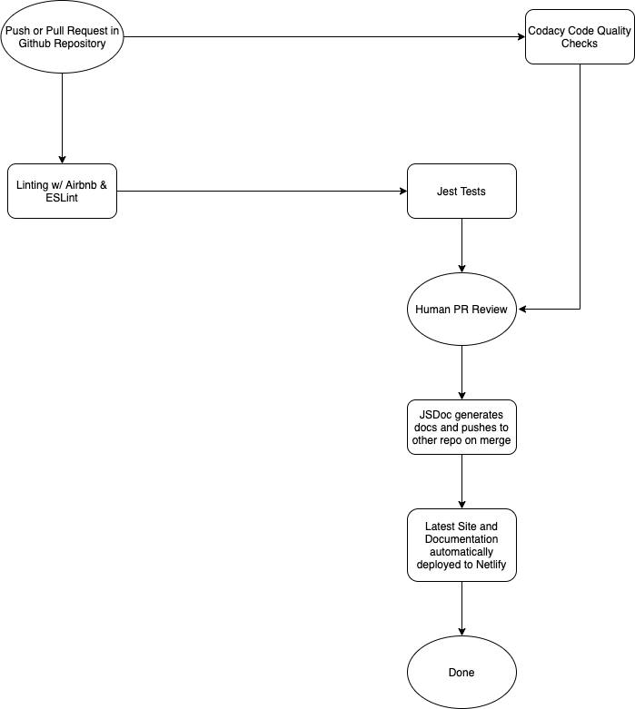

# CI/CD Pipeline Phase 3

The phase 3 updates to our pipeline include running the tests and documentation generation scripts that we have on actual code instead of on sample code, as well as hosting the generated documentation in its own repository.

## Unit Testing

We now have unit tests stored in `source/__tests__`. These are Jest tests that are run on our actual code.

We had to add some dependencies in order to get this done, namely a couple of Babel dependencies that were added to `package.json`.

## Generated Documentation

The documentation is still hosted [here](https://cse110-sp21-group31-docs.netlify.app/). However, it now lives in its own repository at [cse110-sp21-group31/cse110-sp21-group31-docs](https://github.com/cse110-sp21-group31/cse110-sp21-group31-docs). We've updated our Netlify configuration to reflect this fact.

The reason behind this change (we were previously storing generated documentation in `source/out`) is that the automatically generated documentation was causing a *lot* of merge conflicts whenever we wanted to merge pull requests, and the merge conflicts were just due to time differences in the generated docuemtation.

Our new GitHub Action, the source configuration for which can be found at `.github/workflows/docs.yml`, runs every time we merge a pull request into the `main` branch. It generates the documentation and then pushes it to the new repository.

As a result of moving the documentation to its own repository (which is still automatically generated), the generated documentation folder is now a part of our `.gitignore`. Team members can still generate documentation locally if they are working on a branch and need documentation for that branch specifically, but these changes are not pushed to GitHub and are not tracked via source control. Local documentation generation is still done via `npm run docs` inside the `source` folder, as before.

## Diagram of the Phase 3 Pipeline

