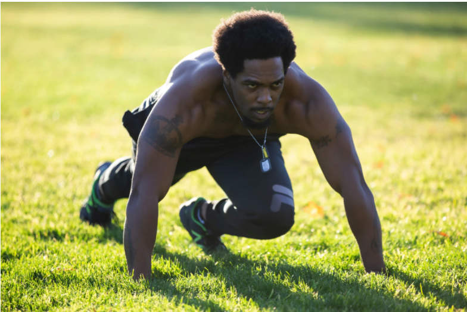
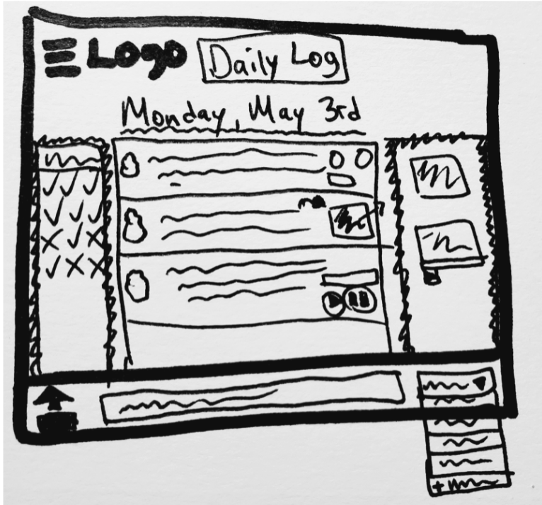

# Bullet Journal Pitch Document - Team 31

## [Google Slides Version](https://docs.google.com/presentation/d/1LN0QaDYnQGybovSRNXuex7BkuSn9WxUcT-Q5lRLusqs/edit?usp=sharing)

## User Personas

### Liam

- Liam, 19 years old
- Sophomore in College, majoring in Biology
- Wants to organize assignments and due dates and start forming productive study habits
- Strives to become a doctor after finishing his education
- Due to the pandemic, school is online
    - Screen time is 6-7 hours
- Technology and software:
    - Mainly uses Laptop and Tablet for classes
    - Phone for social media
    - Uses Chrome, Canvas, and Google Drive

### Lisa

- 35 years old
- Project manager for a S&P 500 company
- Wants to organize work for her team and herself, to deliver projects on time
- Technology and software
    - Primarily uses her laptop
    - Uses phone for social media and communication

### Jon

- 27 years old
- Fitness trainer
- Hard to track multiple clients' fitness progress and goals
- Primarily uses phone
    - Fitness/health tracker apps (MyFitnessPal, Fitbit)

## Problem (Statement of Purpose)

- Target struggling college students who need to organize their life
- There is not a quick and easy way to organize your life digitally?
- Help with the uncertainty brought by the pandemic and online education
    - Online education can require more organization and planning
- No application that combines a daily and long-term task list with features like trackers and journaling
    - Utilize photos, videos, and recordings

## Our Solution

- Index / Home Page
- Daily Log
    - Tasks / Events / Notes
- Weekly View
    - Includes lectures and assignments (recurring option available)
    - Synchronized with Daily Log
- Calendar View
    - Keeps track of all events & tasks from Daily Log
- Filtering System
    - By priority, tags (emojis), colors, finished tasks, etc.
    - For Weekly and Calendar View
- Digital media
    - Images, Audio, Video, Embedded Links
    - Add to any task, note or event

## Fat Marker Sketch

- Navigation and Logo
    - Has a sliding menu for accessing logs
    - Logo leads to the home page
- 3 Main panels
    - Central Panel for notes/tasks/events (NTE)
    - Pinned left and right panels
        - Can be used for pictures, videos, audio
- Bottom bar
    - Add a new NTE to the daily log
    - Select or create tags for the NTE
    - Attach media to the day or side panels

## Flowchart

FLOWCHART GOES HERE - TBD

## Scope

- Time for the project: 4 Weeks
- We are limiting to solving the problem identified for college students (at UCSD) only
- We will prioritizing finishing daily logs, calendar view, and the ability to insert audio/images first
- Any extra features will be optional to add if time permits, but they will not be a priority

## Risks/Rabbit Holes

- Having too many features --- unnecessary complication of the user interface
- Avoid creating too many different logs or interface views
- Bugs to Avoid
    - Empty tasks
    - Editing and Deleting tasks and notes
    - Synchronization between different views (logs, index, etc.)

## No-Gos

- Future Log
    - This is already covered by the calendar
